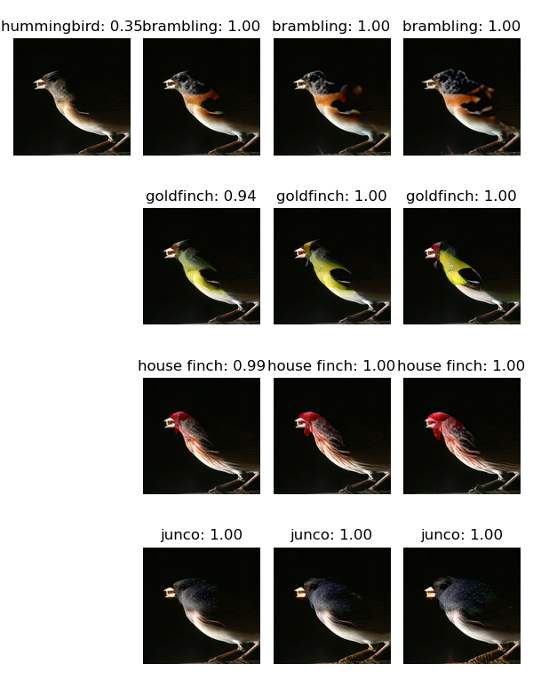

# **Sparse Visual Counterfactual Explanations in Image Space**

Welcome to the codebase for our paper *Sparse Visual Counterfactual Explanations in Image Space.* We will guide you through the process of generating your own l1.5 visual counterfactual explanations on ImageNet with the multiple norm robust model Madry + FT. 
## Examples of l1.5 VCEs for ImageNet

  

  

  

## Setup

Before we can start with the generation, we have to setup the project and install required packages.

* Start by extracting the content of the .zip file that also contains this readme.md somewhere on your computer. We will refer to the extraction directory as **project_path**.
* Navigate into the  **project_path**
* Download the weights for Madry + FT from [here](https://drive.google.com/file/d/169fhxn5X2_1-5vWTepkKJZRMdr8z4b9p/view?usp=sharing) into your **project_path**
* Unzip the model file via `unzip madry_ft.zip`
* Open `utils/datasets/paths.py` and adjust the **base_data_path** in line 6, the default value is `/scratch/datasets/`. Note that we assume that you have extracted ILSVRC2012 to  **base_data_path**/imagenet. If this does not match your folder layout, you can also directly manipulate `get_imagenet_path` in line 64. For example if your dataset is located in `/home/user/datasets/ilsvrc2012/` you could change the function to:

      def get_imagenet_path():  
	      path = '/home/user/datasets/ilsvrc2012/' 
	      return path

* Create a new conda env via `conda env create -f reqs.yml`
* Activate the conda environment via `conda activate vces
`

## Creating  VCEs

 The following script will generate VCEs for samples from the ILSVRC2012 validation set using a l1.5 threat model using the Auto-Frank-Wolfe method described in the paper. The images will have the same structure as Figure 4 in the main paper and Figures 9 and 10 in the Appendix. 

    python imagenet_visual_transfer_hierachy.py --gpu 0 --bs 128 --samples 1 > log
Note that the `--gpu ` argument can take multiple gpu indices, for example `--gpu 4 5 6 7`. The batchsize argument `--bs` is the number of samples per gpu, so if you encounter out-of-memory errors you can reduce it without altering results. The script searches for wordnet subsets that contain between 3 to 10 ImageNet classes and then randomly selects N images per class and creates counterfactuals in all classes in this wordnet cluster. N can be changed via `--samples N` , however be careful as even for N=1, the script creates VCEs for 619 images into multiple target classes. 
The resulting images can be found in `ImageNetHierachyTransfer/l2_improved_3_ep_best/VisualCounterfactuals`. The folder contains multiple individual png and pdf files that show the transformation in all classes and the folders additionally contain the individual images. The format is the following: `{wordnet_cluster}_{imagenet_class}_{linear_idx}_{imagenet_val_idx}`
